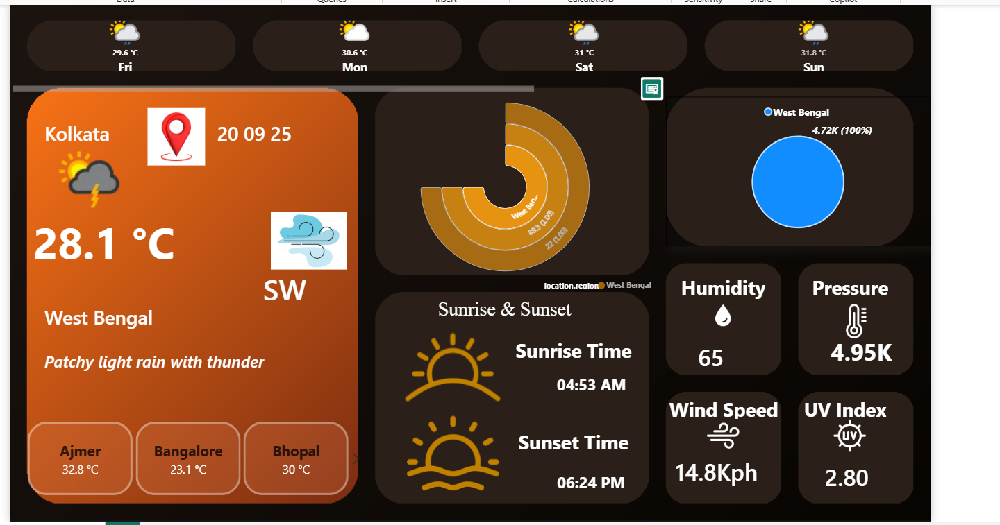

# 🌦️ Weather Dashboard — Power BI

An interactive, dark-themed **Power BI dashboard** that tracks  weather, hourly and daily forecasts, and air quality across 13 major Indian cities — built on top of the  data source.



---

## 📊 Overview

This project pulls real-time and forecast weather data for 13 Indian cities and turns it into a single-page, glanceable dashboard. It surfaces the metrics people actually check day to day — current temperature, humidity, wind, pressure, UV index, air quality, sunrise/sunset times, and a multi-day outlook — inside a clean, dark-mode Power BI report.

**Cities covered:** New Delhi, Mumbai, Bangalore, Chennai, Kolkata, Hyderabad, Pune, Ajmer, Jaipur, Lucknow, Bhopal, Surat, Kochi.

---

## ✨ Dashboard Features

- **Location header card** — city, state, date, live condition icon, current temperature, wind direction, and a short weather description (e.g. *"Patchy light rain with thunder"*)
- **4-day forecast strip** — quick-glance max temperature and weather icon for the next four days
- **Nearby cities panel** — current temperature at a glance for other tracked cities
- **Radial/gauge chart** — visualizes pressure and humidity-style layered metrics by region
- **Air Quality donut** — regional AQI share visualization
- **Sunrise & Sunset card** — daily astronomical timings
- **KPI tiles** — Humidity, Pressure, Wind Speed, and UV Index, each with its own icon
- **Slicer-driven navigation** — click any city to refresh the entire report

---

## 🗂️ Repository Contents

| File | Description |
|------|-------------|
| `Weather_Dashboard.pbix` | The main Power BI report file — open in Power BI Desktop |
| `Current.xlsx` | Live/current weather snapshot for all 13 cities (13 rows) |
| `Forcast_Day.xlsx` | Day-level forecast data — max/min/avg temp, precipitation, astro data (91 rows, ~7-day outlook per city) |
| `Forcast_Hour.xlsx` | Hour-level forecast data — granular temperature, precipitation, solar radiation, etc. (8,174 rows) |
| `MasterReport.xlsx` | Combined dataset joining current + daily + hourly weather and air quality data into one flat table (2,184 rows) — used as the primary Power BI data source |

---

## 🧾 Data Fields


- **Location** — name, region, country, latitude/longitude, timezone, local time
- **Current conditions** — temperature (°C/°F), "feels like", wind speed/direction, pressure, humidity, precipitation, visibility, UV index, cloud cover
- **Air Quality Index** — CO, NO₂, O₃, SO₂, PM2.5, PM10, US-EPA index, UK-DEFRA index
- **Daily forecast** — max/min/avg temperature, chance of rain/snow, total precipitation, sunrise/sunset, moon phase and illumination
- **Hourly forecast** — hour-by-hour temperature, precipitation probability, wind, humidity, solar radiation (short-wave & diffuse)

---

## 🛠️ Tech Stack

- **Power BI Desktop** — report design, DAX measures, visuals
- **Excel (.xlsx)** — staged/flattened data tables feeding the report

---

## 🚀 Getting Started

1. Clone this repository:
   ```bash
   git clone https://github.com/<your-username>/weather-dashboard.git
   ```
2. Open `Weather_Dashboard.pbix` in **Power BI Desktop** (2023 or later recommended).
3. If prompted, update the data source paths to point to the `.xlsx` files in this repo (Home → Transform Data → Data Source Settings).
4. Click **Refresh** to reload the latest data, or explore the report as-is with the bundled snapshot.


---

## 📌 Notes

- Data in this repo is a **point-in-time snapshot** (captured for the cities/dates included) — not a live-refreshing feed.
- `MasterReport.xlsx` is the pre-joined, denormalized table and is the fastest way to explore the full schema in Excel without opening Power BI.
- Wind, pressure, and temperature values are available in both metric and imperial units in the raw data.

---

## 📄 License

This project is open-sourced for portfolio and educational purposes. 
---

## 🙋 Author

**Swapnil Sapkal**
swapnilsapkal2004@gmail.com
https://github.com/swapnilsapkal

https://www.linkedin.com/in/swapnil-sapkal-315a2b290

B.Tech Data Science student | Data Analytics Portfolio Project
